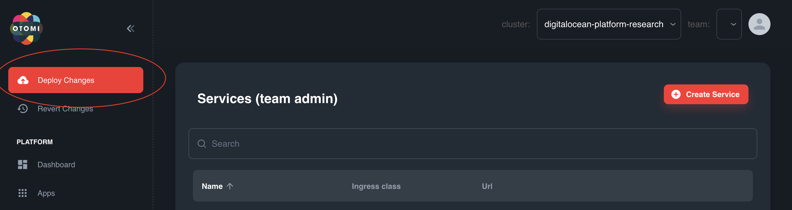

# Application exposure

Once the application is deployed to dev or prod you can expose the application to the outside world by adding an ingress to the application. In this guide we will explain how that can be done.

## 1. Retrieve the information about the application

As soon as your application is deployed in `prod` or `dev` you can find the information about your application in ArgoCD. The information needed for this is the `name` and `namespace`, which can be found here:

## 2. Create a service for the application

In Otomi you can add the application as a service to kubernetes to enable ingress to the application. In order to create this service you need to fill in the following attributes:

- Name: the name of the application

- Namespace: the namespace where the application will be running

- Exposure (ingress) -> `External (public or private network)`

- Ingress traffic inside the cluster -> `Allow all`

You can keep the rest of the values as it is.

## 3. Deploy changes

As soon as you submitted the service you can deploy the changes which will trigger a drone pipeline that will add your application to the ingress controller. Within a few minutes you can go the url and your application will be visible.

