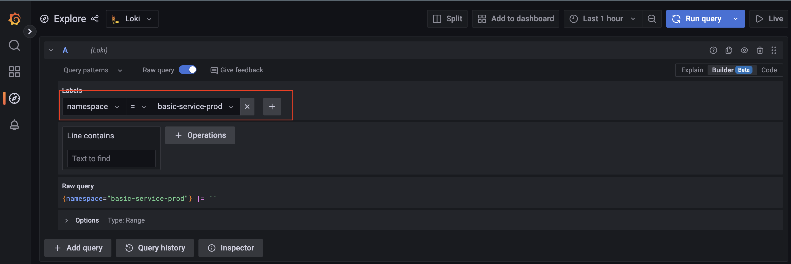

# Logging

By default all the container logs will be gathered by [Loki](https://grafana.com/oss/loki/) and you can query them by going to the grafana frontend in our platform [Link](https://grafana.134.209.138.125.nip.io/explore?orgId=1&left=%7B%22datasource%22:%22Loki%22,%22queries%22:%5B%7B%22refId%22:%22A%22%7D%5D,%22range%22:%7B%22from%22:%22now-1h%22,%22to%22:%22now%22%7D%7D).

## Query logs

In order to query the logs you can create a query that will ensure the correct logs are gathered.

### 1. Parse the logs

By default the logs are not parsed when gathered by Loki, instead the logs can be parsed at runtime, which needs to be enabled when querying the logs. Explained in the image.

### 2. Create query

When querying the logs it is important to filter on the correct namespace. By default each application will have its own namespace, making it easier to filter on a specific application. See image.

After the query is created you can run the query and the logs will be visible.

### 3. Run query

At the top right you can run your queries and you will get the logs based on your query.

