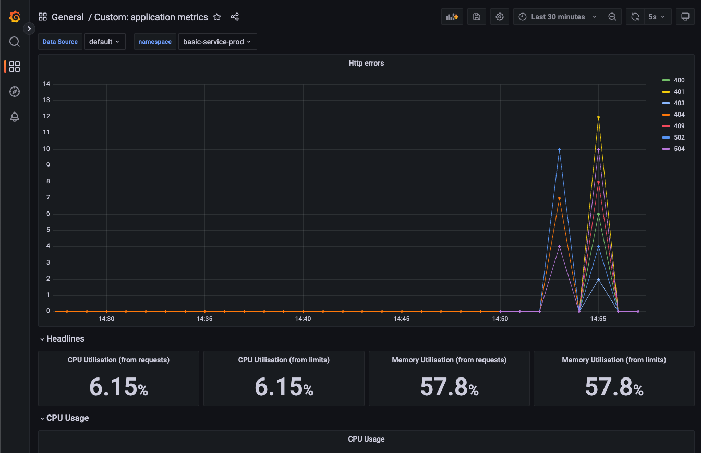

# Observability

By provisioning the applications and deployments through the golden paths the applications will have metrics out of the box. It depends on the software template, but in our case the `nestjs-template` will have custom metrics which will monitor the amount of http exceptions and expose the metrics.

## Dashboarding

The platform will offer pre defined dashboarding which can be used to gather usefull metrics about an application. Each of these dashboards can be filtered by namespace to give specific data.

### Custom: application metrics

The platform have created a dashboard which can be usefull for nestjs applications since it will offer insight in the amount of http errors an application has encountered. Together with the http errors it will also show the memory and CPU usage.

