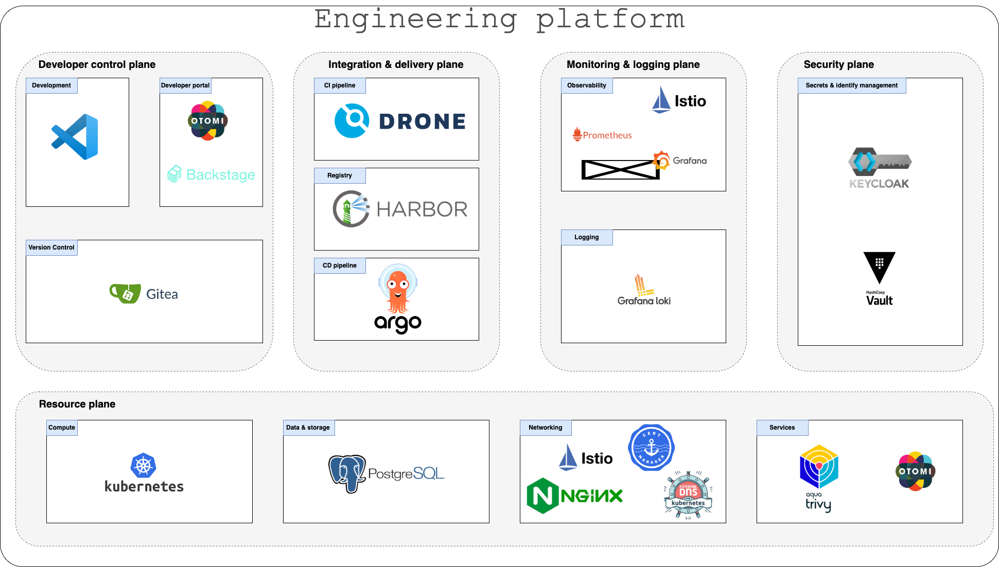

# Platform overview

The platform is divided into different planes and the tools used in each plane are:

## Tooling

- Visual studio code

- Otomi

- Backstage

- Gitea

- DroneCI

- Harbor

- ArgoCD

- Istio

- Prometheus

- Grafana

- Grafana Loki

- KeyCloak

- Hashicorp Vault

- Kubernetes

- PostgreSQL

- Cert manager

- Ngnix

- External DNS

- Trivy