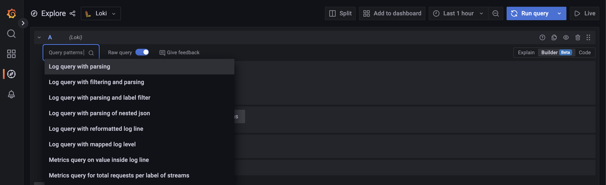
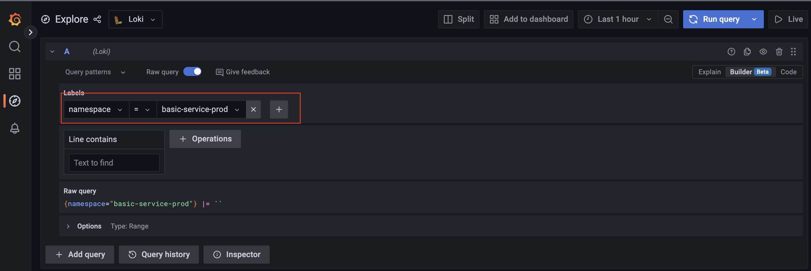
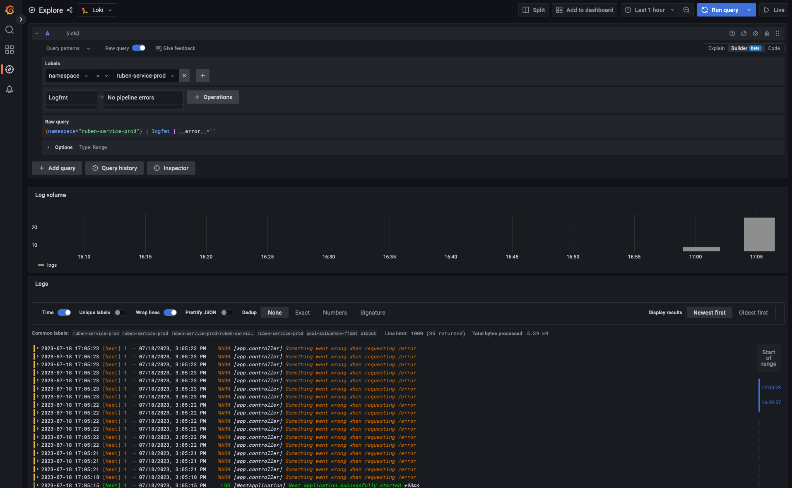
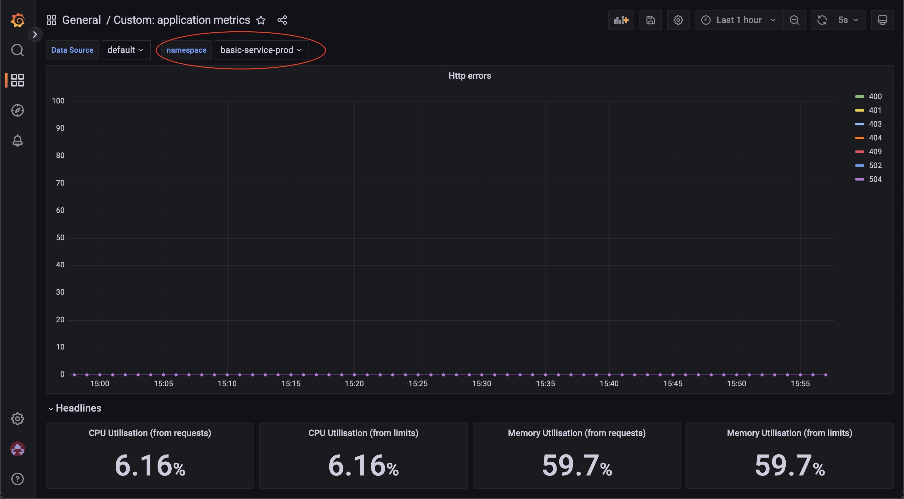

# Application logs and metrics

After an application is deployed to production, it is important to get observability over the application with metrics and logs. The platform provides different tools to help you achieving this. In this tutorial we will go through the different steps to retrieve this information.

## Prerequisites

For this tutorial you need to have a nestjs application running in production and exposed to the outside. This nestjs application has to be provisioned by the platform. 

## 1. Create errors

The first steps in this tutorial is to create errors to provide metrics and logs for this experiment. This can be done by going to your application url and the `/error` endpoint. This endpoint will randomly create a http error which than will be send to prometheus.

## 2. Query logs

The http errors will also generate logs that can be read with Loki. In order to get these logs go to [Loki](https://grafana.134.209.138.125.nip.io/explore?orgId=1&left=%7B%22datasource%22:%22Loki%22,%22queries%22:%5B%7B%22refId%22:%22A%22,%22expr%22:%22%22,%22queryType%22:%22range%22%7D%5D,%22range%22:%7B%22from%22:%22now-1h%22,%22to%22:%22now%22%7D%7D).

Filter on the correct namespace and parse the results. After this is done you will see the logs for the application.

For more details see [this guide](../guide/logging.md).

The logs will look something like this:

## 3. Retrieve the metrics

To validate the status of the application you can use a predefined dashboard that will show the http errors of the application. This dashboard is located in [Grafana](https://grafana.134.209.138.125.nip.io/dashboards) and is called `Custom: application metrics`. 

In order to see the metrics for your application filter on the correct namespace:

