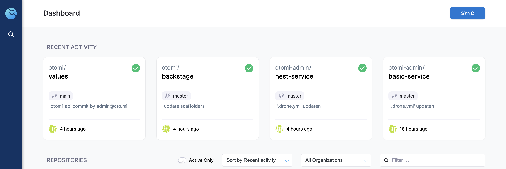
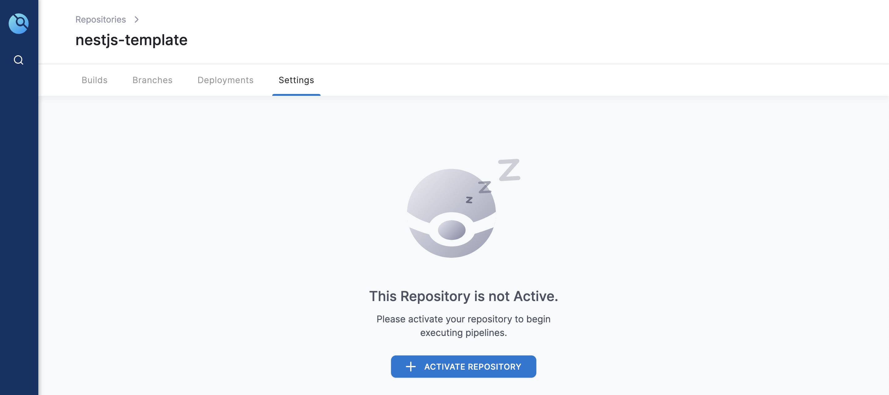
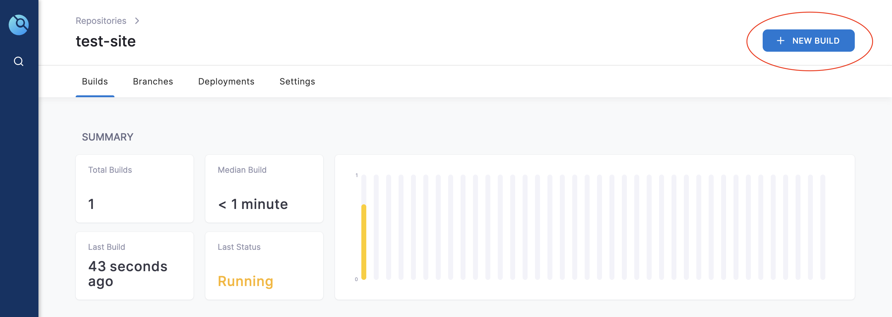
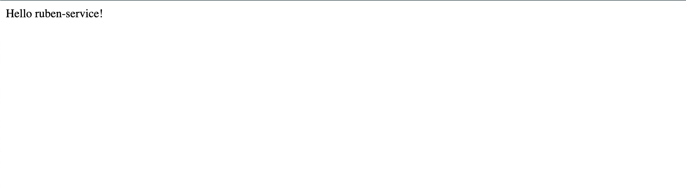

# Tutorial: deploy nest application

In this tutorial we will create, deploy and expose a NestJS application to a development environment. It will help you to understand the fundamentals of the platform. The tutorial will explain it step-by-step and will potential redirect you to the correct guideline that can explain the specific step in more detail.

## 1. Create an application

The first step is to create a NestJS application through the use of the predefined golden paths shipped with the platform. Follow this [link](https://backstage.134.209.138.125.nip.io/create?filters%5Bkind%5D=template&filters%5Buser%5D=all) to go to the golden paths and select the `create nestjs application`.

Fill in the name that you would like, we suggest to use a standard name like `${name}-service` to keep a clear overview.

For more detail about this step see [this guideline](../guide/create-applications.md).

## 2. Sync the pipeline

With the creation of the NestJS application the platform will automatically create a `.drone.yml` file that configures the pipeline in DroneCI. However, to make sure that droneCI will trigger this pipeline when you push code you must sync the repository and active it.

This can be done by following the link that is given at the end of the golden path, or go to this url: [https://drone.134.209.138.125.nip.io/](https://drone.134.209.138.125.nip.io/).

1\. At the top right you can sync the repositories:

2\. Navigate to the repository and active the repository:

3\. After the repository is actived you can start a build on master and the pipeline will be started.

## 3. Validate the harbor image

Once the pipeline has succesfully run a docker image will be created in Harbor. To make sure this is done, navigate to the harbor UI: [https://harbor.134.209.138.125.nip.io/harbor/projects/2/repositories](https://harbor.134.209.138.125.nip.io/harbor/projects/2/repositories). On this page the newly created application should be visible.

## 4. Create a development workload

After we have a docker image in Harbor we can deploy this docker image on kubernetes. In order to get the configurations correct, we can use the [golden path](https://backstage.134.209.138.125.nip.io/create?filters%5Bkind%5D=template&filters%5Buser%5D=all): `create development workload for application` in which you will have to fill in the application name. This golden path will create the following files in [this repository](https://gitea.134.209.138.125.nip.io/otomi/argo-workload):

- `applicationname-dev/deployment.yaml`

- `applicationname-dev/service.yaml`

- `applicationname-dev/servicemonitor.yaml`

- `applicationname.yaml`

It will also update the `.drone.yml` file that is located in the repository of your application named `update-docker-dev`.

See [this guideline](../guide/deploy-applications.md) for more information.

After this golden path is finished you can refresh the services on argoCD to create the new application on Kubernetes. Navigate to the argoCD ui to refresh, link is provided as output of the golden path or use the following link: [https://argocd.134.209.138.125.nip.io/applications/argocd/services?view=tree&resource=](https://argocd.134.209.138.125.nip.io/applications/argocd/services?view=tree&resource=).

To validate that the application is succesfully created go to the overview of all the applications and you will see your application in the list. Click on the application to see the status of the application.

## 5. Create a production workload

After we have validated that the development deployment went succesfull (essential) we can create the production workload. To create the production workload with the necessary modifications to the pipeline and applicationSet we can use the [golden path](https://backstage.134.209.138.125.nip.io/create?filters%5Bkind%5D=template&filters%5Buser%5D=all) named `create-production-workload-for-application`. The input for this golden path is the application name and it will create/update the following files in [this repository](https://gitea.134.209.138.125.nip.io/otomi/argo-workload):

- `applicationname-prod/deployment.yaml` (create)

- `applicationname-prod/service.yaml` (create)

- `applicationname-prod/servicemonitor.yaml` (create)

- `applicationname.yaml` (update)

It will also update the `.drone.yml` file that is located in the repository of your application named `update-docker-prod`.

See [this guideline](../guide/deploy-applications.md) for more information.

After this golden path is done you can refresh the services on argoCD to create the application in production on Kubernetes. Navigate to the argoCD ui to refresh, link is provided as output of the golden path or use the following link: [https://argocd.134.209.138.125.nip.io/applications/argocd/services?view=tree&resource=](https://argocd.134.209.138.125.nip.io/applications/argocd/services?view=tree&resource=).

To validate that the application is succesfully created go to the overview of all the applications and you will see your application in the list. Click on the application to see the status of the application.

## 6. Expose the application

The last step is to expose the deployed NestJS application to the outside world by create a service in [Otomi](https://otomi.134.209.138.125.nip.io/services), which will link the application to the ingress controller.

For the creation of this service you will need to following settings:

- Name of the application

- Namespace where the application is deployed

- Exposure -> external

- Ingress traffic inside cluster --> Allow all.

After filling in all the details and clicking submit at the bottom, we have to deploy the changes to Otomi:

For more details see [this guideline](../guide/expose.md).

This takes approximately five minutes.

## 7. Validate the application

Once every step is done the application should be accessable by using the url stated in the otomi UI.

After you click this URL you should see something like this:

